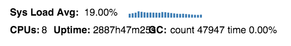

# systems-toolbox

Applications are systems. Systems are fascinating entities, and one of their characteristics is that we can observe them. Read more about that **[here](doc/systems-thinking.md)**.

## Rationale

Some time ago, I wrote this toy application called **[BirdWatch](http://github.com/matthiasn/BirdWatch)**. The first and very basic version was using **[Scala](http://www.scala-lang.org/)** on the server side and **[Knockout](https://github.com/knockout/knockout)** on the client. The next version was then using **[AngularJS](https://angularjs.org/)** on the client side, followed by another client in **[React](https://facebook.github.io/react/)**.js. Then, I fell in love with **[Clojure](http://clojure.org/)**. So I wrote the application again, this time with the backend written in Clojure and the frontend written in **[ClojureScript](https://github.com/clojure/clojurescript)**. It was the first application I had ever written in Clojure. While it worked well, it was a bit of an entangled mess (and hard to maintain). When I discovered Stuart Sierra's component library, I thought this could be a way to get more structure into my system. But it wasn't solving many of the problems that I had. Instead, I wanted to build a different kind of system, one that is primarily messaging-driven, spans multiple machines (such as web client and a server, or also multiple machines on the server side) and that uses **[core.async](https://github.com/clojure/core.async)** for message conveyance. I thought there must be another way to do it, but I didn't find an existing library. Also, at the time, the component library only worked on the server side, whereas I thought that communicating subsystems are a universal thing, not only something that one finds on a server. So I thought, why not write a library that solves my problems, one that works on both client and server? Then came along a consulting gig that allowed me to explore the problem while we wrote a commercial application with it.

## Assumptions

Unsurprisingly, the **systems-toolbox** library makes a few assumptions:

* A system is made out of **subsystems**, which communicate by sending each other immutable messages via **[core.async](https://github.com/clojure/core.async)** channels, which conceptually can be seen as conveyor belts. You WILL have to either watch Rich Hickey's **[talk](http://www.infoq.com/presentations/clojure-core-async)** on this subject or read the **[transcript](https://github.com/matthiasn/talk-transcripts/blob/master/Hickey_Rich/CoreAsync.md)** -- or both. Seriously, do that NOW.

* Hey, welcome back, what do you think about the talk? I think the conveyor belt metaphor is fascinating and may well be more appropriate than in **[other places](http://www.jfs.tku.edu.tw/wp-content/uploads/2014/01/121-E01.pdf)** where it is apparently used as well. Also, I feel the implementation is ready for production usage. However, I think one piece is missing, at least when you follow the metaphor. Let me explain. Say we have a factory or the luggage transportation system in an airport and there's indeed a conveyor belt. The decoupling that comes from using this mechanism (or any other queue, for that matter) is essential for larger systems that don't make you want to pull your hair out. There's one difference, though. The conveyor belt is observable, without interfering with it -- **[core.async](https://github.com/clojure/core.async)** is not.

* **Black boxes** aren't as useful as I used to think. The chances are that a portion of the taxes you pay goes into some very expensive contraptions such as CERNs **[Large Hadron Collider](http://home.cern/topics/large-hadron-collider)** that help us get a better understanding how particles interact, and rightfully so. In natural sciences, it is considered a good thing to look inside stuff (like atoms) and not stop just because someone tells you that you have to respect the borders of a black box. And yet in computer (science), we are supposed to accept that? Come on. When I come into a new project, I would like to look into all the parts of the system and see how they massage the data flowing through that very system. I do understand that implementation details of subsystems may not be important, but at least I need to understand what goes in and what goes out. And this is exactly where I think core.async falls short of the promise of building better systems. Why does the channel need to be a black box that I cannot inspect? I want to be able to see what goes onto a channel, and I want to see what is taken off a channel, just like we a can in the factory with the conveyor belt, without interfering with the system any more than necessary. Of course, everything I just mentioned only works in the realm of **functional programming**. Black boxes make a whole lot more sense when you need to protect mutable state inside objects.

* Subsystems or components wired by the **systems-toolbox** are observable, they emit all messages onto a **firehose** channel, including state changes, without requiring a single extra line of code. This firehose channel contains all the messages flowing through a system, just like the **[Twitter Firehose](https://dev.twitter.com/streaming/firehose)** contains all the tweets flowing through Twitter.

* Subsystems can **send** and **receive** messages. These messages are like sending your tax declaration to the IRS. You expect a response at some point, but you don't know when. Or, to stay more on topic, these are like the messages one layer below TCP. When your computer sends a datagram out, you don't know yet if anyone will respond. Maybe, who knows. If not and a timeout is reached, you will have to deal with that. One might think of this as a limitation, but I have not found that to be the case yet when building actual applications with it. Any reliable transport out there is best just effort plus timeouts plus retries and an eventual exception.

* I like building systems with user interfaces. Therefore, this library also provides the building blocks for user interfaces. This part of the library is opinionated towards **[Reagent](https://github.com/reagent-project/reagent)**, as I like writing DOM subtrees in **[Hiccup](https://github.com/weavejester/hiccup)**. However, it should be simple to write building blocks for the other wrappers for React out there. If I had more time, I'd probably write those.

## Examples

Right now, there are two example applications:

* There's an **[example project](https://github.com/matthiasn/systems-toolbox/tree/master/examples/trailing-mouse-pointer)** in this repository that visualizes WebSocket round trip delay by recording mouse moves and showing two circles at the latest mouse position. One of them is driven by a message that only makes a local round trip in the web application, and the other one is driven by a message that is sent to the server, counted and sent back to the client. Thus, you will see the delay introduced by the by the client-server-client round trip immediately when you move the mouse. Also, there are some histograms for visualizing where time is spent. There's a live example of this application **[here](http://systems-toolbox.matthiasnehlsen.com/)**.

* Then, there's the toy example I mentioned above, **[BirdWatch](https://github.com/matthiasn/BirdWatch)**. This application provided the inspiration for this library. A running demo instance can be seen **[here](http://birdwatch2.matthiasnehlsen.com)**.

## Project maturity

We use this project at my current consulting gig to build a system that spans both the browser and a backend.

Also, applications built with it appear to be quite stable. At the time of this writing, the **[demo instance](http://birdwatch2.matthiasnehlsen.com)** of BirdWatch has been up and running for the past **2887 hours** without problems, during which it processed more than **25 million** tweets. Funny that the resulting string for the uptime duration is slightly longer than anticipated:

Same thing when looking at the library's sample application, only that the uptime here has been longer still at the time of this writing, as you can see in the screenshot above.

This project is quite young and APIs may still change. However, you can expect that minor version bumps do not break your existing system. .

## License

Copyright © 2015, 2016 Matthias Nehlsen

Distributed under the Eclipse Public License either version 1.0 or (at your option) any later version.
