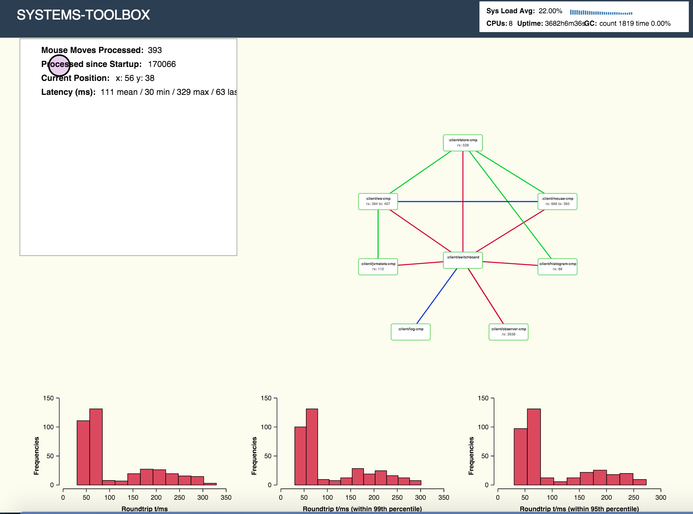
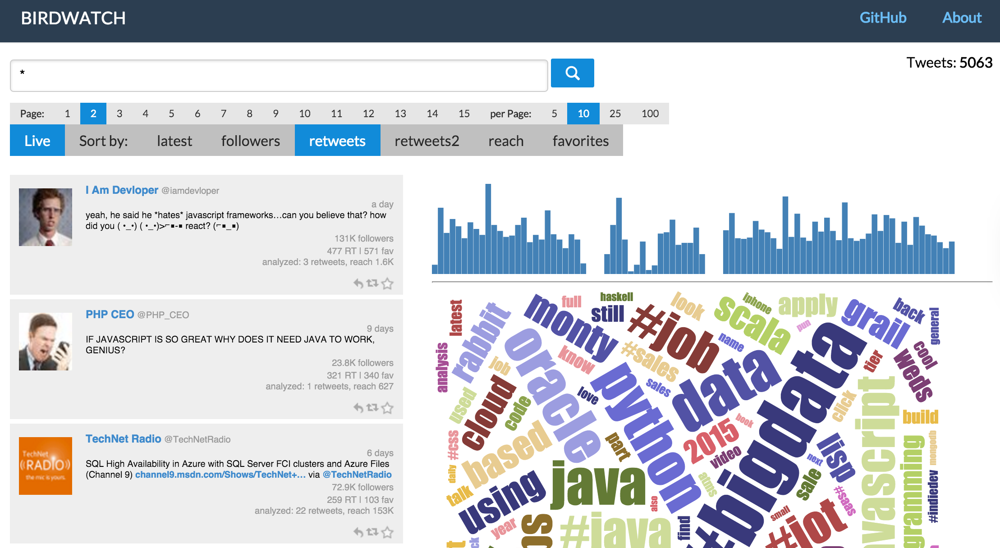

# systems-toolbox

Applications are systems. Systems are fascinating entities, and one of their characteristics is that we can observe them. Read more about that **[here](doc/systems-thinking.md)**. Also make sure you read about the **[rationale](doc/rationale.md)** behind this library.

## What's in the box?

This library helps you build distributed systems. Such a larger system could, for example, consist of multiple processes in different **JVM**, plus all connected browser instances, which, if you think about it, are an important part of the overall distributed systems. Going forward, there is also support planned for native apps. Except for a different presentation layer, the required code should be the exact same as for single-page web applications.

This library only contains the bare minimum for building and wiring systems. Additional functionality can be found in these repositories:

* **[systems-toolbox-ui](https://github.com/matthiasn/systems-toolbox-ui)**: This library gives you a simple way to build user interfaces using **[Reagent](https://github.com/reagent-project/reagent)**. This provided functionality is somewhat comparable to **[React](https://facebook.github.io/react/)** & **[Redux](https://github.com/reactjs/redux)**. I'll elaborate on this soon. This library powers the user interfaces of the example applications.

* **[systems-toolbox-sente](https://github.com/matthiasn/systems-toolbox-sente)**: This library connects browser-based subsystems with a backend system using WebSockets. This library contains everything you need for serving your application via **HTPP**, including support for **HTTPS**, **HTTP2**, deployment in application servers, and serving **REST** resources. This library serves the sample applications and provides the communication with their respective backends.

* **[systems-toolbox-kafka](https://github.com/matthiasn/systems-toolbox-kafka)**: This library connects different systems via **[Kafka](http://kafka.apache.org/)** so that they can form a larger, distributed system.

* **[systems-toolbox-metrics](https://github.com/matthiasn/systems-toolbox-metrics)**: This library is a small example for how functionality can be implemented across subsystems. Here, we have a server-side component which gathers some stats about the host and JVM, plus a UI "widget" that can be embedded in a **systems-toolbox-ui** interface. You can see it in use in both example applications.

## Artifacts

Artifacts are [released to Clojars](https://clojars.org/matthiasn/systems-toolbox).

With Leiningen, add the following dependency to your `project.clj`:

## Testing

This library targets both **Clojure** and **Clojurescript** and is written entirely in `.clc`. Accordingly, testing needs to happen on both the **JVM** and at least one of the **JS** runtimes out there. For testing on the JVM, you simply run:

    $ lein test

On the JavaScript side, you have more options, for example:

    $ lein doo firefox cljs-test once    

Alternatively, you can replace `firefox` with `chrome`, `phantom` or `nashorn`. Instead of `once`, you can also use `auto` to run the tests automatically when changes are detected. For more information about the options, check out the documentation for **[doo](https://github.com/bensu/doo)**.

## Examples

Right now, there are two example applications:

* There's an **[example project](https://github.com/matthiasn/systems-toolbox/tree/master/examples/trailing-mouse-pointer)** in this repository that visualizes WebSocket round trip delay by recording mouse moves and showing two circles at the latest mouse position. One of them is driven by a message that only makes a local round trip in the web application, and the other one is driven by a message that is sent to the server, counted and sent back to the client. Thus, you will see the delay introduced by the by the client-server-client round trip immediately when you move the mouse. Also, there are some histograms for visualizing where time is spent. There's a live example of this application **[here](http://systems-toolbox.matthiasnehlsen.com/)**.

* Then, there's the toy example I mentioned above, **[BirdWatch](https://github.com/matthiasn/BirdWatch)**. This application provided the inspiration for this library. A running demo instance can be seen **[here](http://birdwatch2.matthiasnehlsen.com)**.

## Project maturity

We use this project at my current consulting gig to build a system that spans both the browser and a backend.

Also, applications built with it appear to be quite stable. At the time of this writing, the **[demo instance](http://birdwatch2.matthiasnehlsen.com)** of BirdWatch has been up and running for the past **2887 hours** without problems, during which it processed more than **25 million** tweets.

This project is quite young and APIs may still change. However, you can expect that minor version bumps do not break your existing system. .

## License

Copyright © 2015, 2016 Matthias Nehlsen

Distributed under the Eclipse Public License either version 1.0 or (at your option) any later version.
