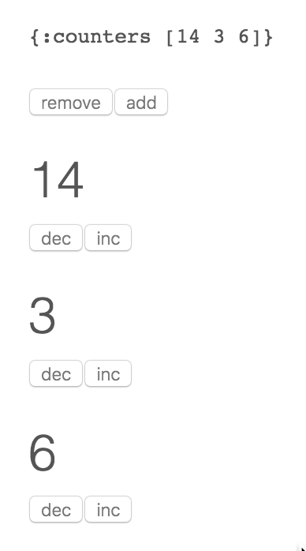

# systems-toolbox-ui - Redux-style counter example




## Usage

You can start the server side application as usual:

    $ lein run

Note that in this step, it does not do anything other than serve a client-side application. This will run the application on **[http://localhost:8888/](http://localhost:8888/)**. You can also change the port using and environment variable:

    $ PORT=9999 lein run

Then, you need to compile the **ClojureScript**:

    $ lein cljsbuild auto release

This will compile the ClojureScript into JavaScript using `:advanced` optimization.

You can also use **[lein-figwheel](https://github.com/bhauman/lein-figwheel)** to automatically recompile and reload the application when you code changes:

    $ lein figwheel

Try for example changing the `inc-handler` after creating a few counter with different number. You'll see that each click increments the counter by 1. Then change the function as follows and DON'T reload the page:

```
(defn inc-handler
  "Handler for incrementing specific counter"
  [{:keys [current-state msg-payload]}]
  {:new-state (update-in current-state [:counters (:counter msg-payload)] #(+ % 11))})
```

Figwheel will reload the application automatically, while the *[systems-toolbox](https://github.com/matthiasn/systems-toolbox)* ensures that each component will retain its previous state. Then click any `inc` button and you'll see that now it increments the counter by 11. This reload also works when changing the CSS.


## License

Distributed under the Eclipse Public License either version 1.0 or (at your option) any later version.
